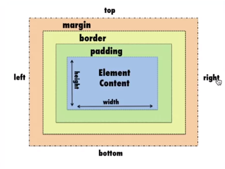

# CSS (Cascading Style Sheets)

CSS (Cascading Style Sheets) significa folha de estilo em cascata e corresponde ao estilo para o HTML. Ele é composto por declarações que irão ditar as propriedades e valores a serem aplidos a um elemento HTML. Ex:

```css
body {
  backgroud: red;
  /*color: green; esta linha será ignorada pois é um comentário*/
}
```

# Cascading (Cascata)

Quando há 2 (ou mais) declarações a última será a mais relevante. Ex:

```css
body {
  background: red;
}

body {
  background: blue;
}
```

Neste caso, o background será azul.

Porém, a cascata perde prioridade quando existe especificidade, seja utilizando `id`, `class` ou `element`. Cada seletor terá uma especificidade e portanto um peso. Ex:

```css
#id {
  /* peso 100 */
}

.class {
  /* peso 10 */
}

element {
  /* peso 1 */
}
```

# Box Model

Todos os elementos HTML serão considerados uma caixa com determinadas propriedades:

- Conteúdo
- Largura
- Altura
- Borda
- Preenchimento (espaço interno)
- Espaçamento (espaço externo).

Veja a representação abaixo:



# Links Úteis

- https://caniuse.com/: útil para verificar se uma propriedade css possui um bom suporte pelos browsers.
- https://fonts.google.com/: permite encontrar fontes e obter os códigos html e css para serem utilizadas.
